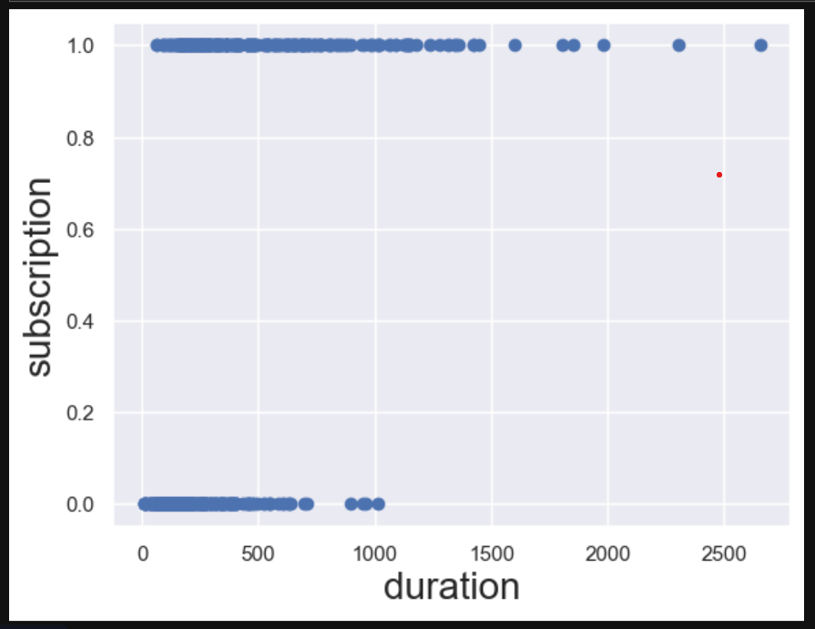

## Project Overview

This project addresses a common business problem in the banking industry: **predicting which customers will respond positively to a marketing campaign for a term deposit product**.

Using logistic regression, I built a classification model that helps the bank:
- Identify customers likely to subscribe
- Optimize call center resource allocation
- Reduce wasted calls and missed opportunities

## Dataset

- **Training data:** 518 customer records
- **Testing data:** 222 customer records (unseen during training)
- **Target variable:** y (1 = subscribed, 0 = not subscribed)
- **Features:**
  - `duration` - Call duration in seconds
  - `interest_rate` - Current interest rate
  - `credit` - Customer credit score indicator
  - `march` - Campaign conducted in March
  - `previous` - Previous campaign success indicator

## Methodology

### Step 1: Simple Logistic Regression
- Used only `duration` as predictor
- Pseudo R-squared: 0.2121
- Coefficient interpretation: Each additional second increases odds by 0.51%

### Step 2: Multiple Logistic Regression
- Added all features: `duration`, `interest_rate`, `credit`, `march`, `previous`
- Pseudo R-squared improved to **0.515** (more than double)

### Step 3: Model Evaluation
- Confusion matrix to visualize prediction results
- Accuracy as primary metric (threshold = 0.5)
- Tested on completely unseen data

## Key Findings

| Feature | Coefficient | P-value | Interpretation |
|---------|-------------|---------|----------------|
| duration | +0.0070 | < 0.001 | Longer calls = higher success |
| interest_rate | -0.7802 | < 0.001 | Higher rates = lower success |
| credit | +2.4028 | 0.027 | Good credit = higher success |
| previous | +1.2746 | 0.029 | Past success predicts future |
| march | -1.8097 | < 0.001 | March campaigns less effective |

## Scatter Plot: Duration vs Subscription

## Results

| Metric | Training | Testing |
|--------|----------|---------|
| Accuracy | 86.49% | 86.94% |
| True Positives | 228 | 99 |
| True Negatives | 220 | 94 |
| False Positives | 39 | 17 |
| False Negatives | 31 | 12 |

## Business Recommendations

1. **Extend call duration** - Each 60 seconds increases odds by 36%
2. **Target high-credit customers** - Most responsive segment
3. **Adjust offers during high interest periods** - Sensitivity is high
4. **Follow up on previous successes** - Past subscribers likely to convert again

## Tech Stack

- **Language:** Python 3
- **Libraries:** 
  - Pandas, NumPy (data handling)
  - Statsmodels (logistic regression)
  - Matplotlib, Seaborn (visualizations)
  - Scikit-learn (confusion matrix, accuracy)

## How to Run

1. Clone this repository
2. Install requirements: `pip install pandas numpy statsmodels matplotlib seaborn scikit-learn`
3. Run the Jupyter notebook: `Bank_Marketing_Predictor.ipynb`

## Author

Abdulmalik Ridwan
